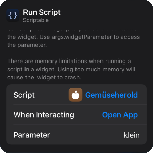

# Gemüseherold
Ein widget zur Anzeige des [Ernteanteils](https://app.kartoffelkombinat.de) des [Kartoffelkombinats](https://www.kartoffelkombinat.de) für iOS ([Scriptable](https://scriptable.app))

## Screenshots


## Installation
- [Scriptable](https://scriptable.app) installieren
- Link folgen: https://github.com/Kiwifed0r/widgets/Gemüseherold.js 
- Script-Text kopieren
- Scriptable öffnen, neues Script erstellen und kopierten Text einfügen.
- Widget dem Homescreen hinzufügen.

## Konfiguration
Standardmäßig wird der normale Ernteanteil angezeigt. Bei Bedarf kann auch der kleine Ernteanteil angezeigt werden. Hierfür die Widgetkonfiguration aufrufen und bei Parameter ```klein``` eingeben, siehe Screenshot.

